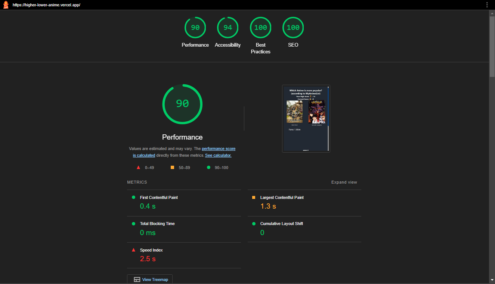
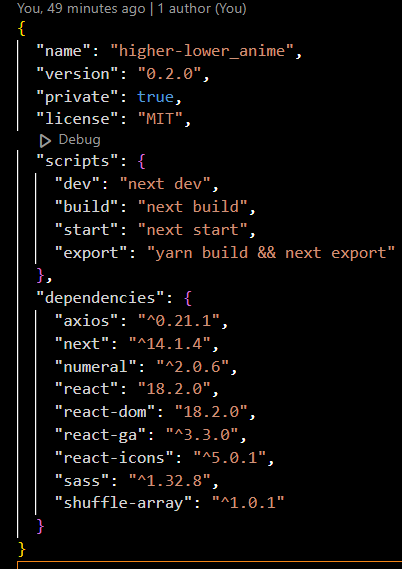
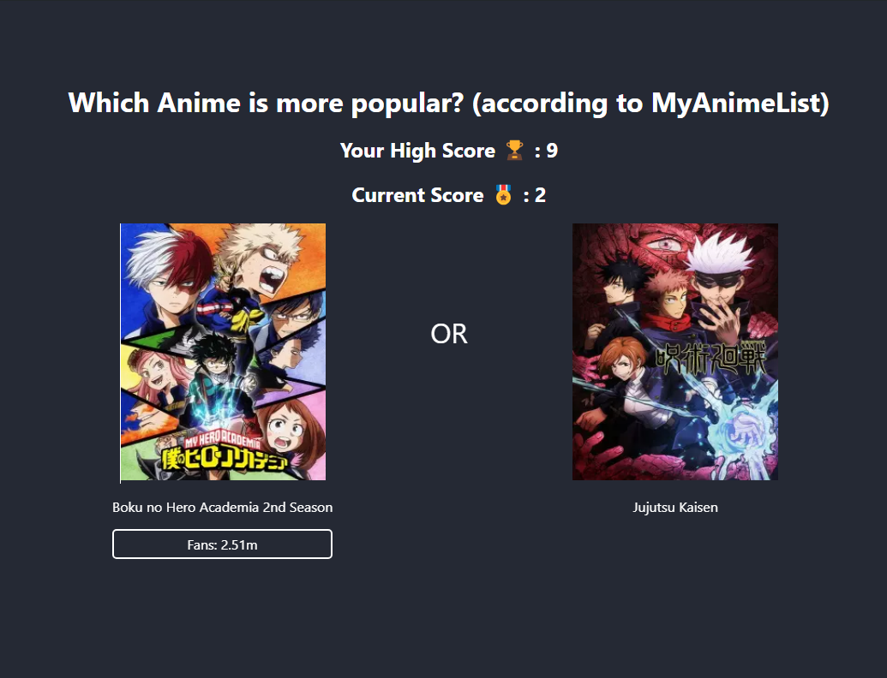

# Higher or Lower Anime edition

## 📄 Description 
Simple Game to guess which anime is more popular  
https://higher-lower-anime.vercel.app 


-18.2.0-red.svg)


## 📓 Table of Contents
- [Higher or Lower Anime edition](#higher-or-lower-anime-edition)
  - [📄 Description](#-description)
  - [📓 Table of Contents](#-table-of-contents)
  - [💡🏡 Lighthouse](#-lighthouse)
  - [🪛 Technologies used](#-technologies-used)
  - [🖥️ Installation](#️-installation)
  - [💬 Usage](#-usage)
  - [🖼️ Screenshot](#️-screenshot)
  - [📹 Video](#-video)
  - [⚖️ License](#️-license)
  - [🤝 Contributing](#-contributing)
  - [🛠️ Tests](#️-tests)
  - [❔ Questions](#-questions)

## 💡🏡 Lighthouse
This is the Lighthouse Google report showcasing Performance 🚀, Accessibility ♿️, Best practices ✅, and SEO 🔍.


## 🪛 Technologies used 
| Technology                  | Description                             | Link                                                   |
|-----------------------------|-----------------------------------------|--------------------------------------------------------|
| Node.js                     | Server-side JavaScript runtime          | [Node.js](https://nodejs.org/)                         |
| Font Awesome (React)        | Font Awesome for React components      | [Font Awesome (React)](https://fontawesome.com/)       |
| React                       | JavaScript library for building UIs    | [React](https://reactjs.org/)                          |
| React DOM                   | React rendering for the DOM            | [React DOM](https://reactjs.org/)                      |
| React Icons                 | SVG icon library for React             | [React Icons](https://react-icons.github.io/react-icons/) |
| Semantic UI CSS             | Front-end framework                    | [Semantic UI CSS](https://semantic-ui.com/)            |
| Semantic UI React           | React integration for Semantic UI      | [Semantic UI React](https://react.semantic-ui.com/)     |
| SweetAlert2                 | Alert library for JavaScript           | [SweetAlert2](https://sweetalert2.github.io/)          |
| ESLint                      | JavaScript linter                      | [ESLint](https://eslint.org/)                          |
| ESLint (Plugin React)       | ESLint plugin for React                | [ESLint (Plugin React)](https://eslint.org/)           |
| ESLint (Plugin React Hooks) | ESLint plugin for React Hooks          | [ESLint (Plugin React Hooks)](https://www.npmjs.com/package/eslint-plugin-react-hooks) |
| ESLint (Plugin React Refresh)| ESLint plugin for React Refresh       | [ESLint (Plugin React Refresh)](https://www.npmjs.com/package/eslint-plugin-react-refresh) |
| axios                       | Promise-based HTTP client for the browser and Node.js | [axios](https://github.com/axios/axios)       |
| next                        | React framework for static and server-rendered applications | [next](https://nextjs.org/)          |
| numeral                     | Number formatting library              | [numeral](http://numeraljs.com/)                       |
| sass                        | CSS extension language                 | [sass](https://sass-lang.com/)                         |
| shuffle-array               | Array shuffling utility                | [shuffle-array](https://www.npmjs.com/package/shuffle-array) |
| Yarn                        | Package manager for Node.js projects   | [Yarn](https://yarnpkg.com/)                           |
| Vercel                      | Cloud platform for serverless deployment | [Vercel](https://vercel.com/)                          |

    
## 🖥️ Installation 
Run command to install package depenencies  
```yarn install```

  
Package.json dependencies ⚙️ 
 

## 💬 Usage 
N/A


## 🖼️ Screenshot



## 📹 Video

  
## ⚖️ License 
This project is licensed under MIT
  
## 🤝 Contributing 
N/A
  
## 🛠️ Tests
N/A
 
## ❔ Questions
If you have any questions about this project, please contact me directly at brian.trang9@gmail.com. Feel free to view more of my projects at https://github.com/Makeredundant.